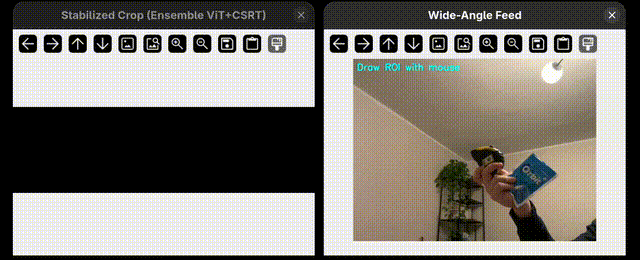

# Stabilizacja ROI — PoC trackingu dla kamery chirurgicznej

System elektronicznego pan-tilt-zoom (ePTZ): chirurg zaznacza region na obrazie z szerokokatnej kamery na klatce piersiowej, a system utrzymuje ten region wycentrowany i stabilny w oknie wyjsciowym — bez mechanicznych czesci, w czasie rzeczywistym.



## Problem

Chirurg nosi kamere na klatce piersiowej. Kamera widzi szerokie pole, ale chirurg chce widziec tylko wybrany fragment (np. reke, narzedzie, pole operacyjne). System musi:

- Sledzic zaznaczony region klatka po klatce
- Utrzymywac go na srodku stabilizowanego okna wyjsciowego
- Nie przeskakiwac na inne obiekty (twarz, cialo) przy okluzji
- Dzialac w czasie rzeczywistym

## Top 3 podejscia

### 1. ViT Improved (`stabilize_vit_improved.py`)

**Co to robi**: Uzywa Vision Transformer (maly model ONNX, 700KB) do sledzenia zaznaczonego regionu. Dodane zabezpieczenia: blokada nagłego wzrostu bbox (zeby nie przeskoczyc z reki na cala postac), porownanie histogramu kolorow z oryginalnym zaznaczeniem, predykcja pozycji podczas utraty celu.

**Zalety**: Najszybszy z deep trackerow (~330 FPS), najnizszy sredni blad na prostych scenariuszach, agresywnie odrzuca falszywe dopasowania.

**Wady**: Przy przejsciu reki przed twarza traci tracking na ~57% klatek (bezpieczny ale uzytkownik widzi zamrozony obraz).

```bash
python stabilize_vit_improved.py --source 0              # kamera na zywo
python stabilize_vit_improved.py --source demo.mp4       # z pliku wideo
python stabilize_vit_improved.py --source 0 --padding 120  # wiecej kontekstu wokol ROI
```

### 2. DaSiamRPN (`stabilize_dasiamrpn.py`)

**Co to robi**: Uzywa Distractor-Aware Siamese Region Proposal Network — siec siamska ktora porownuje szablon (template) z regionem wyszukiwania (search window) poprzez cross-korelacje. Modele ONNX (~156MB). Dodane te same zabezpieczenia co w ViT (blokada skali, histogram, velocity).

**Zalety**: Rzadziej traci cel, dobry na szybki ruch, wbudowany mechanizm anchor boxes obsluguje zmiany proporcji.

**Wady**: Najwolniejszy (~40 FPS). Po okluzji blisko twarzy przeskakuje na nia (bbox rosnie o 58%) — problem fundamentalny dla Siamese architectury. Modele duze (156MB).

```bash
python stabilize_dasiamrpn.py --source 0
python stabilize_dasiamrpn.py --source demo.mp4
```

### 3. Hybrid CSRT + Optical Flow (`stabilize_hybrid.py`)

**Co to robi**: Laczy trzy warstwy:
- **CSRT** (Discriminative Correlation Filter with Channel and Spatial Reliability) — sledzi wyglad ROI
- **LK Optical Flow** — sledzi ruch punktow wewnatrz ROI klatka-po-klatce
- **Global Motion Compensation** — estymuje ruch kamery z punktow POZA ROI (RANSAC), zeby odroznic ruch kamery od ruchu celu

Wynik z trzech warstw jest laczony z wagami zaleznymi od confidence. Pozycja cropa wygladzana filtrem Kalmana z dead-zone (nie reaguje na drobne drganial).

**Zalety**: Najlepszy wynik na najtrudniejszym tescie (reka blisko twarzy + okluzja): 87.7% success. Optical flow z RANSAC lepiej separuje cechy reki od twarzy niz deep matching. Nie wymaga GPU.

**Wady**: Wolniejszy od ViT (~96 FPS), gorzej radzi sobie z szybkim ruchem. Kod najbardziej zlozony.

```bash
python stabilize_hybrid.py --source 0
python stabilize_hybrid.py --source demo.mp4
python stabilize_hybrid.py --source 0 --padding 60 --output-size 640
```

## Jak odpalic

### Wymagania

- Python 3.10+ (testowane na 3.14)
- Kamera USB lub plik wideo
- ~200MB na modele ONNX

### Instalacja

```bash
cd poc

# Stworz virtualenv
python3 -m venv .venv
source .venv/bin/activate

# Zainstaluj zaleznosci
pip install -r requirements.txt
```

### Pobranie modeli

Model ViT (700KB) jest juz w `models/`. Modele DaSiamRPN (156MB) trzeba pobrac recznie jesli nie ma:

```bash
cd models

# ViT tracker (powinien juz byc)
# ls vitTracker.onnx

# DaSiamRPN (potrzebne tylko dla stabilize_dasiamrpn.py)
wget -O dasiamrpn_model.onnx "https://www.dropbox.com/s/rr1lk9355vzolqv/dasiamrpn_model.onnx?dl=1"
wget -O dasiamrpn_kernel_r1.onnx "https://www.dropbox.com/s/999cqx5zrfi7w4p/dasiamrpn_kernel_r1.onnx?dl=1"
wget -O dasiamrpn_kernel_cls1.onnx "https://www.dropbox.com/s/qvmtszx5h339a0w/dasiamrpn_kernel_cls1.onnx?dl=1"

cd ..
```

### Uruchomienie

```bash
# Aktywuj venv
source .venv/bin/activate

# Wybierz jedno z trzech podejsc:
python stabilize_vit_improved.py --source 0         # ViT (deep, szybki)
python stabilize_dasiamrpn.py --source 0            # SiamRPN (deep, Siamese)
python stabilize_hybrid.py --source 0               # Hybrid (klasyczny, najodporniejszy)

# Z pliku wideo zamiast kamery:
python stabilize_vit_improved.py --source demo.mp4
```

### Sterowanie

| Klawisz | Akcja |
|---|---|
| Przeciagnij myszka | Zaznacz ROI na oknie "Wide-Angle Feed" |
| `r` | Zaznacz ROI od nowa |
| `+` / `-` | Zoom in / out (zmiana paddingu wokol ROI) |
| `q` / `ESC` | Wyjscie |

Otworza sie dwa okna:
- **Wide-Angle Feed** — pelny obraz z kamery, na nim zaznaczony ROI (zielony prostokat)
- **Stabilized Crop** — wyciete i powiekszone okno wokol ROI (to widzi chirurg)

## Benchmark

Syntetyczny benchmark testuje trackery na 7 scenariuszach (gladki ruch, okluzja, przeskok skali, szybki ruch, distraktor, kradzież przez twarz, kradzież przez twarz + okluzja):

```bash
# Odpal wszystkie trackery na wszystkich scenariuszach
python benchmark.py

# Tylko wybrany tracker
python benchmark.py --tracker vit_improved

# Tylko wybrany scenariusz
python benchmark.py --scenario face_steal face_steal_occ

# Z wizualizacja (otwiera okno)
python benchmark.py --visualize
```

Pelne wyniki i analiza: [models_comparison.md](models_comparison.md)

## Struktura

```
poc/
  README.md                    # ten plik
  requirements.txt             # zaleznosci pip
  demo.gif                     # animacja demo (GIF, ~1MB)
  models_comparison.md         # pelna analiza porownawcza z benchmarku
  benchmark.py                 # framework benchmarkowy (7 scenariuszy syntetycznych)
  models/
    vitTracker.onnx            # model ViT (700KB)
    dasiamrpn_model.onnx       # model DaSiamRPN (87MB) — gitignored, pobierz recznie
    dasiamrpn_kernel_cls1.onnx # kernel cls DaSiamRPN (23MB) — gitignored
    dasiamrpn_kernel_r1.onnx   # kernel reg DaSiamRPN (46MB) — gitignored
  stabilize_vit_improved.py    # PoC 1: ViT Improved
  stabilize_dasiamrpn.py       # PoC 2: DaSiamRPN
  stabilize_hybrid.py          # PoC 3: Hybrid CSRT + OptFlow
```

## Znany problem: przeskok na twarz

Kiedy reka (sledzony cel) przechodzi przed twarza, wszystkie bbox trackery maja tendencje do przeskoczenia na twarz. Twarz jest silniejszym atraktorem wizualnym (ostre gradienty, kanoniczny obiekt w pretrained modelach). Hybrid CSRT radzi sobie najlepiej (87.7% success), ale zaden bbox tracker nie rozwiazuje tego fundamentalnie.

Nastepny krok to tracker oparty na **segmentacji masek** (SAM2 / XMem) — maska reki ma inny ksztalt niz maska twarzy, wiec model wie "to nie sa moje piksele" nawet jesli regiony sie nakladaja.
